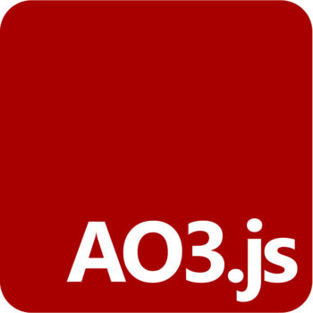

# AO3.js

<div align="center">



Scrapes data from [ao3.org](https://ao3.org). Now with Types™.

<!-- Add the <a> so IMGs will stay on the same line -->
<a href="#">
    
</a>
<a href="#">
    
</a>
<a href="https://gitpod.io/from-referrer/">
    
</a>
<a href="https://fancoders.com/">
    
</a>
</div>

## What it is

Fetch data from AO3 straight to your own JavaScript (or TypeScript) server.

## How to use it

With yarn

```sh
yarn install @bobaboard/ao3.js
```

or npm

```sh
npm install @bobaboard/ao3.js
```

Then go to town on your JavaScript (or TypeScript) files

```ts
import { getTag } from "@bobaboard/ao3.js";

const tag = await getTag({
  tagName: "Ever Given Container Ship (Anthropomorphic)",
});
```

Further explanation of AO3.js works and suggestions for how to add to it can be found [in this comment](https://github.com/essential-randomness/AO3.js/issues/2#issuecomment-1032213524). Also consider taking a look at [TypeScript types](./src/types/entities.ts).

## Difference between this and the Python library

JavaScript vs Python aside, this is a newer library that is being actively developed, and is not feature complete. If you'd like for us to prioritize a feature, [please open an issue](https://github.com/essential-randomness/ao3.js/issues/new).

# Documentation

AO3.js uses [axios](https://axios-http.com/) to fetch the HTML making up an AO3 page and [cheerio](https://cheerio.js.org/) to make it a DOM tree for our goals. For an introduction to this kind of scraping, [see here](https://blog.logrocket.com/parsing-html-nodejs-cheerio/).

For the rest of the owl, you can reach us through our [Issues tab](https://github.com/essential-randomness/ao3.js/issues), or at [Fandom Coders](https://fancoders.com/).

# Volunteering

...for fun and zero profit!

## The Ideal Volunteer™

You.

## The Ideal Volunteer™, jokes aside

AO3.js is a great entry point into JavaScript (or TypeScript) programming for inexperienced and experienced developers alike. The library itself is pretty straightforward, so you can get a good overview of the How and Why™ without a lot of additional complexity.

## How to add more data to scrape

The best way to get to work on AO3.js is to choose a new set of data to scrape.

### Choose your data

To identify what we're missing (and tour the codebase as a bonus):

1. Take a look at our [TypeScript types](./src/types/entities.ts). If the data you seek is not there, we most likely can't scrape it (yet).
2. See if there's already [an open issue](https://github.com/essential-randomness/ao3.js/issues/) for the type of data you seek.
3. See if we're aready [scraping the page](./src/types/pages.ts) the data resides in.

Congratulations, you now have your first contribution carved for you!

### Contribution path

Once you've chosen the type of data, it's time to define its shape.

1. If there's already [an open issue](https://github.com/essential-randomness/ao3.js/issues/) describing the TypeScript type of the data you want to add, let us know you intend to implement the feature.
2. Submit a PR with the new TypeScript type you intend to implement under [`src/types/entities.ts`](./src/types/entities.ts), so we can review the API together. Alternatively, you can [open a new issue](https://github.com/essential-randomness/ao3.js/issues/new) to discuss beforehand.

If you don't know what any of this means, [open a new issue](https://github.com/essential-randomness/ao3.js/issues/new) anyway and let us help you through the process.

## Other contributions we're seeking

Some ideas off the top of my head:

- Set up our release process
- Set up linting/styling and all the bell and whistles that make open source projects cool
- Autogenerate our documentation from TypeScript types
- Teach us all how to do semantic releases.

Honestly, this library is your oyster. Just open an issue, and let's roll!
